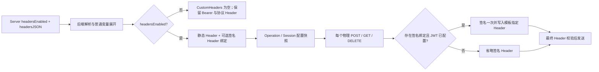

# MCP 自定义 Header 开关、签名模板变量与 Go Demo 设计

- 日期：2026-07-13
- 状态：已批准，待实施计划
- 目标分支：`codex/mcp-custom-headers`

## 1. 背景与决策

当前实现已经支持 DEEIX 原生 Header 模板、后端权威校验、黑名单、预览、敏感值掩码，以及固定写入 `X-DEEIX-Context` 的 HS256 签名上下文。此次变更需要完成四件事：

1. 将 Header 规则说明从大块内联提示移动到标题旁的 `?` Tooltip。
2. 新增“应用默认模板”，新建服务器仍从 `{}` 开始，仅由管理员主动应用。
3. 新增可持久化的自定义 Header 开关；关闭时保留模板，重新开启时恢复。
4. 将签名上下文从固定 Header 改为可选模板变量，并提供一个可验证完整认证链路的 Go MCP Demo Server。

已批准的关键决策：

- Header 覆盖与保留名称继续采用后端黑名单机制。
- 模板契约使用 DEEIX 系统变量，不强制兼容 Open WebUI。
- `headersEnabled` 持久化到服务器记录，关闭不清空 `headersJSON`。
- 新建服务器默认模板仍为 `{}`，通过“应用默认模板”按钮显式替换草稿。
- 新增 `{{DEEIX_SIGNED_CONTEXT}}`，不再强制使用 `X-DEEIX-Context`。
- 已配置签名策略但未引用签名变量时，只警告，不阻止保存或调用。
- 未配置签名策略时允许不使用签名变量；模板包含该变量时给出非阻断提示。
- 默认模板包含 `X-MCP-CLIENT-SIGNED-CONTEXT` 映射。

## 2. 备选方案

### 2.1 模板变量驱动（采用）

签名 JWT 作为 `{{DEEIX_SIGNED_CONTEXT}}` 暴露，Header 名称完全由模板决定。它维持单一 Header 配置入口，并能保留每个物理请求重新签名的安全语义。

### 2.2 独立“签名 Header 名称”字段（不采用）

运行时实现较简单，但会让普通 Header 模板和签名 Header 字段形成两套配置来源，容易发生展示、预览与实际发送不一致。

### 2.3 通用动态凭据变量框架（暂不采用）

可进一步支持 OAuth、外部密钥提供器等动态变量，但会扩大模板解析、密钥生命周期和 transport 接口的改造范围，本次需求没有必要承担该复杂度。

## 3. 范围与非目标

本次范围包括：MCP Server 持久化/API/Swagger、Header 模板内核、应用调用配置、transport/session、管理前端、双语文案、独立 Go Demo、测试和使用说明。

本次不做：

- 不允许模板覆盖 `Authorization`、MCP 协议 Header、传输 Header、追踪 Header或整个 `X-DEEIX-*` 命名空间。
- 不把 Bearer Token 并入自定义模板；它继续使用服务器的独立 `authToken` 配置。
- 不增加 Open WebUI 兼容别名。
- 不让前端成为 Header 合法性或签名策略的最终裁决者。
- 不改变 JWT 算法、轮换、TTL 和 claims 的既有安全策略。

## 4. 持久化与 API 契约

### 4.1 数据模型

在 MCP Server model、domain 和 repository 输入中增加：

```text
headers_enabled / headersEnabled: boolean
```

数据库列为 `NOT NULL DEFAULT true`。已有数据库通过现有 schema/AutoMigrate 链路增加列，旧记录迁移后为 `true`，保持原行为。

语义只控制 `HeadersJSON` 模板，包括模板承载的签名上下文；不控制：

- `Authorization: Bearer ...`
- `Accept`、`Content-Type` 等 HTTP 传输 Header
- `MCP-Protocol-Version`、`MCP-Session-Id`、`Last-Event-ID`

关闭时保留原始 `headersJSON`。保存或更新模板时仍执行完整后端校验，避免持久化无法重新启用的非法模板。运行时关闭状态可以跳过模板展开，因此即使遇到历史坏数据，也能通过关闭功能恢复连接。

### 4.2 HTTP DTO

- Server response 增加必有字段 `headersEnabled`。
- Create request 使用可选布尔值：省略按 `true` 处理，显式 `false` 才关闭。
- Update request 使用可选布尔值：省略表示不修改。
- 审计 `changedFields` 增加 `headersEnabled`，不记录 Header 内容或签名凭据。
- 同步更新 Swagger 注释和 `backend/docs/{docs.go,swagger.json,swagger.yaml}`。

### 4.3 签名上下文准备响应

当前准备/轮换响应中的固定字段：

```json
{ "header": "X-DEEIX-Context" }
```

改为模板契约：

```json
{
  "templateToken": "{{DEEIX_SIGNED_CONTEXT}}",
  "recommendedHeader": "X-MCP-CLIENT-SIGNED-CONTEXT"
}
```

该响应只提供模板变量和推荐名称，不宣称后端会固定注入某个 Header。

## 5. Header 模板契约

### 5.1 第十一个 DEEIX 系统变量

新增：

```text
{{DEEIX_SIGNED_CONTEXT}}
```

它是延迟展开的敏感变量，与其他十个普通上下文变量不同：普通变量可以在应用层用稳定上下文展开，签名变量必须在每一个实际 HTTP 请求发送前生成，以确保 `iat`、`exp`、`jti` 和重试边界正确。

为避免凭据拼接、残留前后缀和部分替换歧义，签名变量必须独占一个 Header 的完整值，并且一个模板最多配置一个签名 Header：

```json
{
  "X-MCP-CLIENT-SIGNED-CONTEXT": "{{DEEIX_SIGNED_CONTEXT}}"
}
```

嵌入字符串、同一模板重复绑定或用未知 token 模拟签名变量均由后端拒绝或按既有未知变量规则报告，不能把未展开 marker 发送到网络。

### 5.2 黑名单

继续保留：

- 精确名称黑名单；
- `MCP-*`、`Proxy-*`、`Sec-*`、`X-DEEIX-*` 前缀黑名单；
- Header 名称规范化后的重复检测；
- Header 数量、单值、模板 JSON 和展开后总大小限制。

删除 transport 对固定 `X-DEEIX-Context` 的写入，但不为该名称开放黑名单例外。推荐使用 `X-MCP-CLIENT-SIGNED-CONTEXT`。

### 5.3 权威警告

签名转发状态的派生逻辑集中在后端，避免前后端重复定义。新增非阻断 warning code：

- `signed_context_not_referenced`：Header 已开启、JWT 已配置，但模板没有签名变量。
- `signed_context_not_configured`：Header 已开启、模板包含签名变量，但 JWT 未配置。
- `signed_context_headers_disabled`：JWT 已配置，但自定义 Header 功能关闭。

预览请求携带草稿的 `headersEnabled` 和可选 `serverID`；有 `serverID` 时后端读取真实签名配置，再返回语法警告和签名转发警告。新建服务器没有签名策略，因此应用默认模板后返回“保存后配置签名上下文”的提示。持久化 Server response 同样返回基于已保存状态计算的 `headerWarnings`，不把 warning 写入数据库。

这些 warning 不阻止创建、更新、probe、sync 或 chat。目标 MCP Server 是否接受未签名身份，仍由目标服务决定。

### 5.4 预览

预览的 supported token 列表增加签名变量。预览不生成真实 JWT；只显示敏感掩码，并将承载签名变量的 Header 标记为 sensitive。任何响应、日志、trace 或错误 details 均不得包含真实 JWT、密钥或未掩码身份凭据。

## 6. 运行时数据流



具体约束：

1. 应用层解析模板并展开普通 DEEIX 变量，同时提取可选的签名 Header 绑定；不在应用层生成 JWT。
2. `CallConfig`、operation snapshot、session clone/equality/digest 增加签名 Header 名称，确保名称或开关变化不会复用错误 session。
3. Header 关闭时，`CustomHeaders`、签名 Header 绑定和 `SignedContext` 都为空；Bearer 与协议 Header 不受影响。
4. Header 开启、签名变量存在且策略有效时，transport 在每个物理请求中只调用 signer 一次，再写入模板指定名称。
5. 签名变量存在但策略未配置时，省略整个签名 Header，绝不能发送 `{{DEEIX_SIGNED_CONTEXT}}` 原文或空凭据。
6. 策略已配置但变量缺失时，不调用 signer，并继续请求。
7. 策略有效且签名失败、结果为空、包含非法 Header 字符或超限时，在发送前失败，不静默降级。

probe、sync、chat、初始化、分页、SSE resume 和 DELETE cleanup 均走同一规则。

## 7. 管理前端

### 7.1 标题、Tooltip 和开关

“自定义 Header 模板”标题旁增加可聚焦的 `?` 图标和 Tooltip。Tooltip 承载现有四段说明：后端权威校验、明文风险、黑名单规则、敏感掩码保留规则；原黄色大块说明区域删除。图标提供可访问名称，键盘和触摸设备可访问。

同一区域增加持久化开关：

- 默认开启；
- 关闭后编辑器、模式选择、预览操作和默认模板按钮禁用，但仍可查看原内容；
- 关闭时保存不依赖 preview current；
- 重新开启后必须完成最新后端预览才能提交；
- 开关变化属于连接配置变化，保存后继续执行现有 probe + sync 流程。

### 7.2 默认模板

新建服务器仍初始化为 `{}`。“应用默认模板”只替换当前未保存草稿，不自动创建、更新或启用签名策略：

```json
{
  "X-MCP-CLIENT-USER-PUBLIC-ID": "{{DEEIX_USER_PUBLIC_ID}}",
  "X-MCP-CLIENT-USER-DISPLAY-NAME": "{{DEEIX_USER_DISPLAY_NAME}}",
  "X-MCP-CLIENT-USER-EMAIL": "{{DEEIX_USER_EMAIL}}",
  "X-MCP-CLIENT-USER-ROLE": "{{DEEIX_USER_ROLE}}",
  "X-MCP-CLIENT-CONVERSATION-PUBLIC-ID": "{{DEEIX_CONVERSATION_PUBLIC_ID}}",
  "X-MCP-CLIENT-ASSISTANT-MESSAGE-PUBLIC-ID": "{{DEEIX_ASSISTANT_MESSAGE_PUBLIC_ID}}",
  "X-MCP-CLIENT-USER-MESSAGE-PUBLIC-ID": "{{DEEIX_USER_MESSAGE_PUBLIC_ID}}",
  "X-MCP-CLIENT-REQUEST-ID": "{{DEEIX_REQUEST_ID}}",
  "X-MCP-CLIENT-RUN-ID": "{{DEEIX_RUN_ID}}",
  "X-MCP-CLIENT-TRACE-ID": "{{DEEIX_TRACE_ID}}",
  "X-MCP-CLIENT-SIGNED-CONTEXT": "{{DEEIX_SIGNED_CONTEXT}}"
}
```

默认值作为前端 model 常量维护并由单元测试锁定；服务端仍对最终 JSON、Header 名称、token 和限制进行权威校验。

### 7.3 签名上下文面板

面板不再展示固定 `X-DEEIX-Context`，改为展示：

- 模板变量 `{{DEEIX_SIGNED_CONTEXT}}`；
- 推荐 Header `X-MCP-CLIENT-SIGNED-CONTEXT`；
- 当前持久化模板是否已经建立签名转发绑定。

所有 warning 使用后端 code 映射中英文文案，不通过字符串匹配推断。

## 8. Go MCP Demo Server

### 8.1 技术选择与布局

在根目录创建独立 module：

```text
demo/go-mcp-server/
  cmd/server/main.go
  internal/config/
  internal/identity/
  internal/server/
  go.mod
  go.sum
  README.md
```

MCP 协议采用[官方 Go SDK v1.6.0](https://github.com/modelcontextprotocol/go-sdk/releases/tag/v1.6.0)的 Streamable HTTP 实现；JWT 使用 `github.com/golang-jwt/jwt/v5 v5.3.1`。两项依赖均放在 Demo 的独立 `go.mod`，不污染 `backend/go.mod`。

端点：

- `POST/GET/DELETE /mcp`：MCP Streamable HTTP。
- `GET /healthz`：不返回配置或身份信息的健康检查。

### 8.2 配置

环境变量：

- `MCP_DEMO_ADDR`，默认 `127.0.0.1:8090`。
- `MCP_DEMO_BEARER_TOKEN`，必填，用于 MCP 访问认证。
- `MCP_DEMO_SIGNED_CONTEXT_HEADER`，默认 `X-MCP-CLIENT-SIGNED-CONTEXT`。
- `MCP_DEMO_CONTEXT_SECRET`，启用签名验证时必填。
- `MCP_DEMO_CONTEXT_ISSUER`、`MCP_DEMO_CONTEXT_AUDIENCE`、`MCP_DEMO_CONTEXT_KEY_ID`，启用签名验证时必填。

服务拒绝弱配置组合，例如只填写部分 JWT 验证参数。Bearer 至少 32 字节，比较前分别取 SHA-256，再使用常量时间比较。不得把真实值写入 README、示例配置、日志或测试快照。

### 8.3 认证与身份验证

Bearer middleware 是访问 MCP 端点的强制认证层：缺失或不匹配返回 `401`。通过 Bearer 后：

1. 仅按 allowlist 解析默认模板中的十个普通身份 Header，不扫描或回显任意 `X-MCP-CLIENT-*` Header。
2. 从可配置 Header 读取可选签名上下文，限制大小后验证 HS256。
3. 严格验证算法、`kid`、issuer、audience、`exp`、`nbf`、`iat` 和 subject。
4. 对比普通 Header 与 JWT claims 中重叠的身份字段，生成 mismatch 列表。
5. 将不可变的结构化结果放入 request context，供 MCP tool 使用。

缺少签名 Header、签名无效或字段不一致不会绕过 Bearer，也不会让 middleware 伪造验证成功。为使 Demo 能展示诊断结果，这些情况允许 MCP 协议继续进入工具，工具返回 `verified: false` 和安全的原因 code；目标生产 MCP 服务可以选择更严格的拒绝策略。

十个普通身份 Header 为：

- `X-MCP-CLIENT-USER-PUBLIC-ID`
- `X-MCP-CLIENT-USER-DISPLAY-NAME`
- `X-MCP-CLIENT-USER-EMAIL`
- `X-MCP-CLIENT-USER-ROLE`
- `X-MCP-CLIENT-CONVERSATION-PUBLIC-ID`
- `X-MCP-CLIENT-ASSISTANT-MESSAGE-PUBLIC-ID`
- `X-MCP-CLIENT-USER-MESSAGE-PUBLIC-ID`
- `X-MCP-CLIENT-REQUEST-ID`
- `X-MCP-CLIENT-RUN-ID`
- `X-MCP-CLIENT-TRACE-ID`

普通 Header 只作为 `unverified` 诊断信息，不能用于授权；有效的签名 claims 才是权威用户身份。DEEIX 当前使用 canonical base64url 字符串本身的字节作为 HS256 key，Demo 必须与该行为一致，不能先解码 secret 后再验签。

Bearer 通过官方 SDK 的认证接口接入，并提供稳定、不可逆的 transport principal 作为 session 绑定身份。绑定摘要按以下顺序选择稳定身份材料：

1. 签名有效时使用 Bearer principal 加已验证的 `sub`、mode、conversation 和 run 身份；
2. 签名缺失或无效但存在普通身份 Header 时，使用 Bearer principal 加 allowlist Header 的规范化摘要，仅用于 session 隔离，仍不得用于授权；
3. 完全没有最终用户身份时只使用 Bearer principal，此时系统只声明 transport client 身份，不声称区分不同最终用户。

绑定摘要始终排除每次变化的 `jti`、`iat` 和 `exp`，从而同时防止已声明身份之间复用 Session ID，以及错误切断同一 run 的恢复请求。

### 8.4 `identity_check` 工具

工具无必填参数，返回结构化结果：

```text
authenticated        Bearer 已通过（进入工具时恒为 true）
checkedAt            当前 UTC RFC3339 时间
verification         present/configured/valid/verified/reason
identity             普通 Header 解析出的用户、会话、消息、request/run/trace 信息
signedIdentity       验证成功后允许返回的签名 claims 身份摘要
mismatches           普通 Header 与签名 claims 的字段差异
```

`verified=true` 仅在签名存在、验证成功且重叠身份字段无冲突时成立。没有签名变量时仍可调用工具，但必须明确返回 `verified=false`。

### 8.5 安全与生命周期

- 不记录 Bearer、JWT、签名 secret、原始 Header、email 或完整 claims。
- 为请求 Header 和 JWT 设置显式大小限制。
- 使用 `http.Server` 超时和信号驱动的 graceful shutdown。
- 只接受 MCP `2025-11-25`，保留 SDK 的 Content-Type 检查；为 SDK v1.6.0 显式提供非 nil 的 Go 1.26 `http.CrossOriginProtection`，并保留 localhost/DNS rebinding 防护。
- 健康检查不暴露认证状态或配置细节。
- 错误响应只返回稳定、安全的原因 code。

## 9. 测试策略

实施遵循 TDD，每项先写失败测试。

### 9.1 后端

- Schema：旧表升级后 `headers_enabled=true`；显式 false 可持久化并可重新开启。
- Repository/domain：Create/Update/读取映射完整。
- HTTP：Create 省略默认 true、显式 false、PATCH 省略不变；response、audit、Swagger 契约一致。
- Template：第十一个 token、完整值限制、重复绑定、未知/畸形 token、黑名单和预览掩码。
- Warnings：三种签名转发状态及非阻断行为。
- Application：关闭时无自定义 Header/签名配置，但 Bearer 不受影响；开启恢复。
- Transport：指定 Header 名称、每个物理 POST/GET/DELETE 重新签名、marker 不泄漏、失败不发送。
- Session/operation：Header 名称和开关参与快照/比较，不发生跨配置复用。
- Lifecycle/stress：更新既有 D 阶段测试，继续验证隔离、取消、cleanup 和无敏感日志。

### 9.2 前端

- 默认模板内容和顺序锁定。
- Form model 覆盖开关 create/update diff。
- 关闭状态不要求 preview current；开启状态仍要求。
- Tooltip 文案迁移后不再渲染原黄色说明块。
- 默认模板按钮替换草稿并使预览过期。
- 后端 warning code 的中英文映射。
- Context JWT 准备响应类型和面板不再依赖固定 Header。

### 9.3 Demo

- 配置校验和常量时间 Bearer 认证。
- 无 Bearer/错误 Bearer 返回 401。
- 无签名、有效签名、过期签名、错误算法、错误 kid/issuer/audience、超限 Header。
- 普通身份 Header 解析和 JWT 字段不一致。
- `identity_check` 返回 UTC 时间及正确的 verified 语义。
- MCP initialize、tools/list、tools/call 最小协议集成测试。
- 身份 A 建立的 Session ID 不能被身份 B 复用；非法 Origin 和协议版本被拒绝。
- graceful shutdown，且日志不包含测试 secret/token/PII。

## 10. 验收标准

1. 自定义 Header 开关跨刷新持久化，关闭不清空模板且不影响 Bearer/MCP 协议 Header。
2. 固定 `X-DEEIX-Context` 注入路径完全移除；签名只通过模板变量发送。
3. 缺少签名变量只产生可见警告，不阻止保存或调用。
4. 默认模板由按钮主动应用，全部使用 `X-MCP-CLIENT-*` 名称并包含签名变量。
5. Tooltip 承载原四段说明，原内联说明块删除。
6. Go Demo 可在本地启动，通过 Bearer 认证并用 `identity_check` 返回当前时间、身份解析和签名验证结果。
7. 后端完整测试/race/vet/build、前端 test/lint/build、Demo test/vet/build 及根 Docker build 全部通过。
8. Swagger、前端手写类型、README 和实际行为一致，且无凭据或 PII 泄漏。

## 11. 实施边界

设计规格批准后，使用 `superpowers:writing-plans` 生成逐任务计划。实施采用用户指定的 Subagent-Driven 模式，每个任务先规格审查、再质量审查；所有产品代码遵循 `superpowers:test-driven-development`，Go Demo 同时遵循 Go 项目布局、测试、错误处理、安全与 context/lifecycle 指南。
